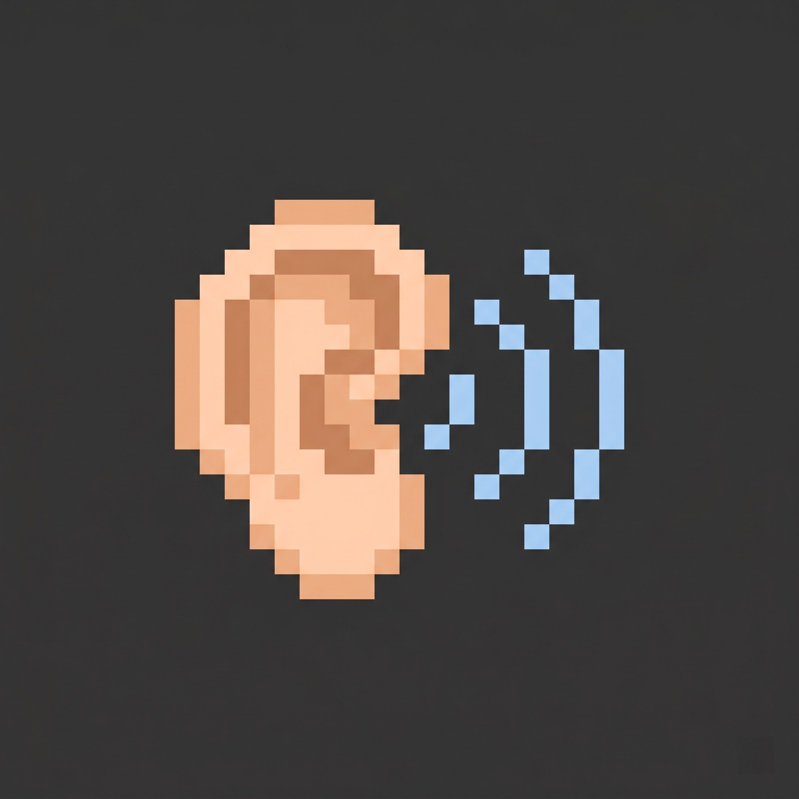

# SoundPulse

Client-side Minecraft mod that captures in-game sounds and displays directional visual indicators on your HUD. See where sounds are coming from at a glance.



## Features

- **Directional Sound Visualization** — Detects where a sound originates (front, back, left, right, corners) and draws fading arc indicators on the corresponding screen edge
- **Distance Scaling** — Close sounds produce thicker, more detailed arcs that expand aggressively; distant sounds are thinner and subtler
- **Category Colors** — Each sound category has a distinct color:
  - Hostile (red), Blocks (orange), Ambient (green), Players (blue), Music (purple), Weather (cyan), Neutral (yellow), Voice (gray)
- **Threat Alerts** — Creeper priming and TNT ignition trigger a fast red strobe effect for immediate awareness
- **Sound Ignore List** — Block specific sounds from showing any overlay
- **Customizable** — Toggle the mod on/off, enable/disable categories, change colors, all in-game

## Commands

| Command | Description |
|---------|-------------|
| `/soundpulse toggle` | Enable/disable the mod |
| `/soundpulse config` | View current configuration |
| `/soundpulse category <name> <true/false>` | Enable or disable a sound category |
| `/soundpulse color <category> <RRGGBB>` | Set a custom color for a category |
| `/soundpulse ignore add <sound_id>` | Add a sound to the ignore list |
| `/soundpulse ignore remove <sound_id>` | Remove a sound from the ignore list |
| `/soundpulse ignore list` | List all ignored sounds |

## Configuration

Settings are saved to `config/soundpulse.json` and can be edited manually:

```json
{
  "enabled": true,
  "maxOpacity": 0.65,
  "enabledCategories": ["HOSTILE"],
  "categoryColors": {},
  "ignoredSounds": []
}
```

Only the **HOSTILE** category is enabled by default. Use the `/soundpulse category` command to enable others.

## Requirements

- Minecraft 26.1.x
- Fabric Loader >=0.18.5
- Fabric API >=0.145.4

## Installation

1. Install Fabric Loader for Minecraft 26.1.x
2. Download Fabric API and place it in your `mods` folder
3. Download SoundPulse and place it in your `mods` folder

## Building from source

```bash
./gradlew build
```

The compiled JAR will be in `build/libs/`.

## License

MIT
