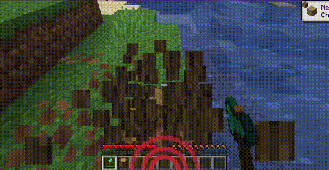

# 🔊 SoundPulse

SoundPulse is a lightweight, high-performance client-side utility mod for Minecraft Fabric 26.1.x. It visualizes in-game sounds as minimalist, directional waves on your HUD, providing a tactical edge and enhanced spatial awareness without the clutter of vanilla subtitles.

Whether you are playing with your own music, have hearing difficulties, or simply want a cleaner way to track threats, SoundPulse delivers a sleek, modern solution.



---

## ✨ Key Features

### 🧭 8-Way Directional Tracking

SoundPulse doesn't just tell you a sound happened — it shows you exactly where it came from. The HUD displays curved wave icons pointing to 8 specific directions:

- **Front, Back, Left, Right**
- **Front-Right, Front-Left, Back-Right, Back-Left**

### 📏 Distance-Based Scaling

The visual intensity of the waves adapts to the proximity of the sound source:

- **Near:** Thick, aggressive lines for immediate threats
- **Far:** Thin, subtle lines for distant background noises

### ⚠️ Critical Threat Alerts (Strobe Effect)

Never get blindsided by a Creeper again. High-priority sounds like Creeper hissing or TNT priming trigger a rapid red strobe/flash effect on the corresponding direction of the HUD.

### 🛡️ Smart Filtering & Presets

To keep your screen clean, SoundPulse starts with **Hostile** sounds enabled by default. You can easily toggle other categories (Blocks, Players, Ambient, Music, Weather, Neutral, Voice) to suit your playstyle.

### 🎨 Category Colors

Each sound category has a distinct color:

| Category | Color |
|----------|-------|
| Hostile | Red |
| Blocks | Orange |
| Ambient | Green |
| Players | Blue |
| Music | Purple |
| Weather | Cyan |
| Neutral | Yellow |
| Voice | Gray |

---

## 💻 Commands

SoundPulse is fully configurable in-game. Every change you make is instantly saved to your configuration file.

| Command | Description |
|---------|-------------|
| `/soundpulse toggle` | Enable or disable the mod entirely |
| `/soundpulse config` | View your current settings and active categories in chat |
| `/soundpulse category <name> <true/false>` | Toggle entire sound categories on or off |
| `/soundpulse color <category> <hex>` | Change the wave color for a specific category |
| `/soundpulse ignore add <id>` | Add a specific sound to the ignore list |
| `/soundpulse ignore remove <id>` | Remove a sound from the ignore list |
| `/soundpulse ignore list` | List all ignored sounds |

---

## ⚙️ Configuration

Settings are saved to `config/soundpulse.json`:

```json
{
  "enabled": true,
  "maxOpacity": 0.65,
  "enabledCategories": ["HOSTILE"],
  "categoryColors": {},
  "ignoredSounds": []
}
```

Only the **HOSTILE** category is enabled by default. Use `/soundpulse category` to enable others.

---

## 🔧 Building from Source

```bash
./gradlew build
```

The compiled JAR will be in `build/libs/`.

---

## 📄 License

MIT © Cukkoo
